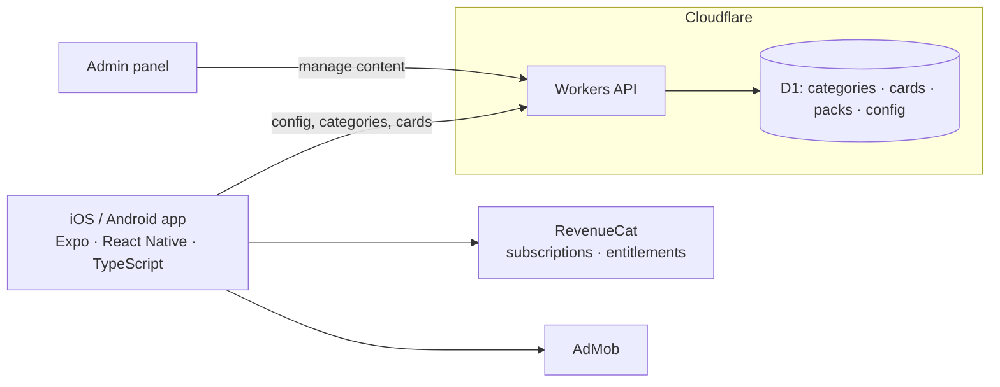

# Architecture

## Key decisions

| Decision | Why |
|---|---|
| Backend-driven content and config | Content is the product, so it has to change daily without app releases |
| Cloudflare Workers + D1 | Cheap, fast, nothing to manage, and plenty for read-heavy card data |
| RevenueCat for billing | One entitlement system across iOS and Android, so there's no receipt validation to maintain |
| Ad frequency set by the backend | Revenue and retention can be balanced without shipping a build |
